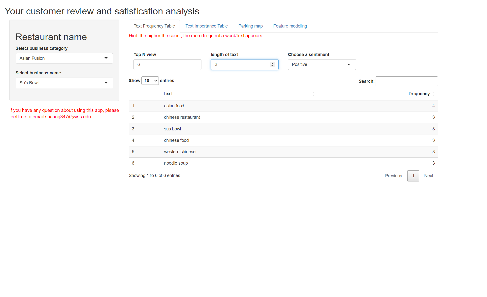
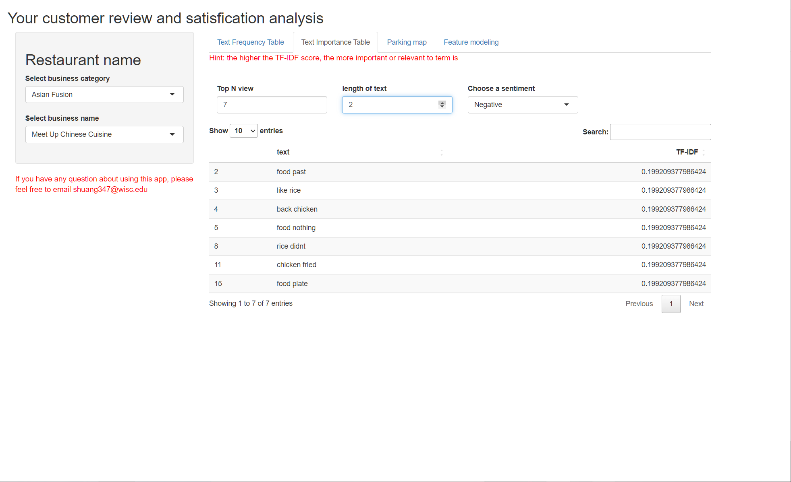
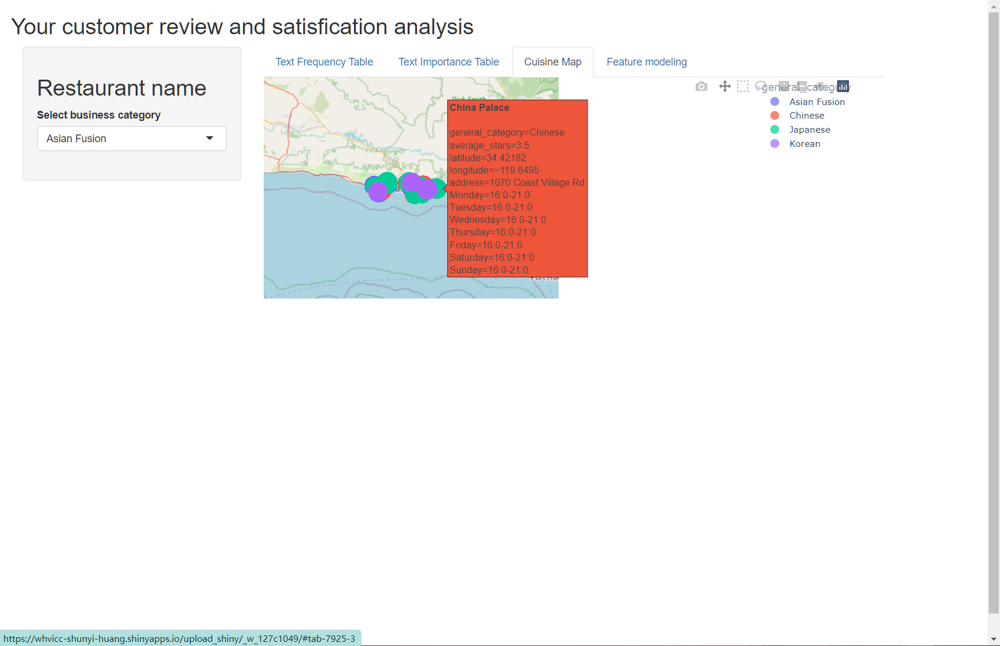
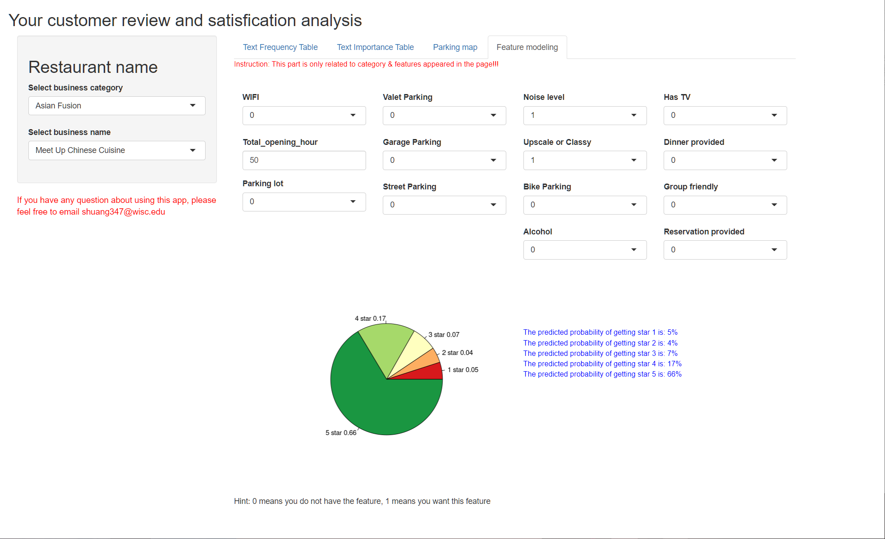

# Stats-628-Module-3

This is a project that we are working on to help business owner to improve their .

There are Five folders named as "Code", "Data", "Data Description", and "Pics".  

1).The Code folder contains files that were written using python or R. 
'file type conversion.ipynb' serves to turn Json file to CSV files  
'Data Cleaning.ipynb' serves a general data cleaning purposes such as extracing information from Json/CSV file, clean up text data, adding new features, etc  
'data_cleaning_for_models.ipynb' returns dataset for modeling purpose  
'EDA_xxx.Rmd' are EDA code  
'app.R' is the main shiny app code, which will take use functions in the 'py_fun.py'  

2).Inside the Data Work folder: 
CA_Asian_business_review.csv is mainly used for NLP and text analyzing pusposes 
final_dataxxx.csv are maniny used for modeling purposes 

3).The data description file contains introduction of all the datasets  

4).The Image folder contains two heatmaps of all features, two htmls that were used in our shiny app, and four pngs that are used in .md file  

Setting up python virtual environment in shinyapps.io, please see this example [Setting virtual environment](https://github.com/ranikay/shiny-reticulate-app/blob/master/.Rprofile) 

[Shiny Link](https://whvicc-shunyi-huang.shinyapps.io/upload_shiny/)

